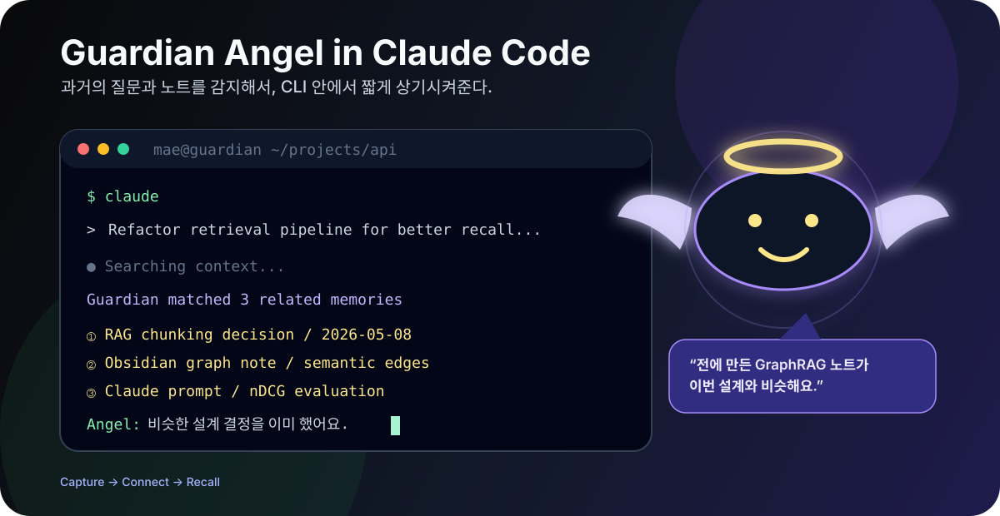
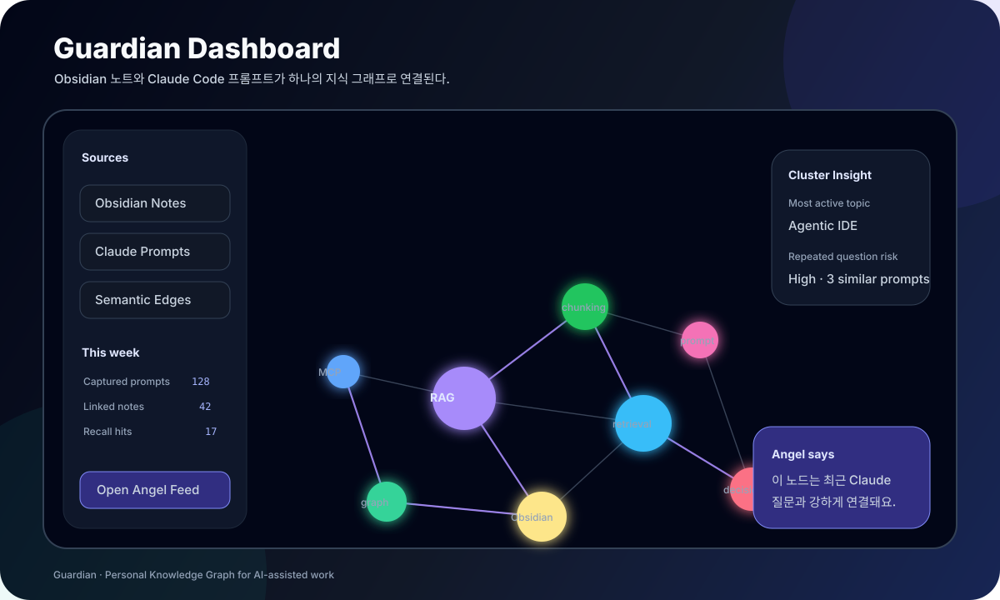
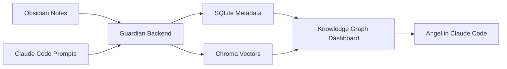
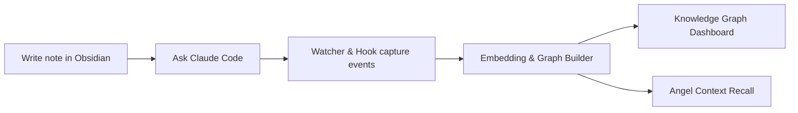
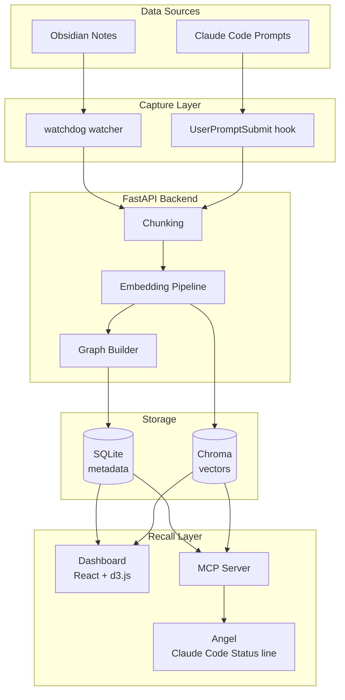

# Guardian

<p align="center">
  
</p>

<p align="center">
  <b>Capture → Connect → Recall</b>
</p>

<p align="center">
AI와 함께 만든 생각의 흔적을 자동으로 모으고,<br />
연결하고, 다시 꺼내주는 개인 지식 그래프.
</p>

---

## What is Guardian?

Guardian은 Obsidian 노트와 Claude Code 프롬프트를 자동으로 수집하고,
의미 기반으로 연결해서 하나의 지식 그래프로 보여준다.

AI를 많이 사용할수록 질문은 늘어나지만,
생각과 학습은 세션 종료와 함께 사라진다.

Guardian은 그 흐름 자체를 데이터로 저장한다.

---

## Preview

<p align="center">
  
</p>

<p align="center">
  
</p>

<details>
<summary><b>Guardian flow 보기</b></summary>



</details>

---

## Problem

AI 도구 사용량이 늘면서 발생하는 세 가지 문제.

### 1. Repeated Questions

같은 문제를 AI에게 반복적으로 묻는다.

노트에 정리했더라도,
실제 코딩 중에는 검색하지 않는다.

### 2. Ephemeral Learning

AI 응답은 세션 종료와 함께 사라진다.

학습 결과가 장기 기억으로 남지 않는다.

### 3. Missing Connections

질문, 노트, 설계 결정이 서로 연결되지 않는다.

결과적으로 비슷한 패턴을 다시 처음부터 고민하게 된다.

---

## Target User

Guardian은 아래와 같은 사용자를 대상으로 한다.

* Claude Code / Cursor / ChatGPT를 매일 사용한다.
* Obsidian 또는 비슷한 PKM 도구를 장기간 사용한다.
* 노트 100개 이상을 보유하고 있다.
* 같은 질문을 AI에게 두 번 이상 해본 적 있다.
* AI-assisted coding workflow를 구축하고 있다.

---

## Core Idea

Guardian의 핵심은 단순 검색이 아니다.

> “지금 하는 작업과 비슷한 과거 사고 흐름을 자동으로 다시 떠오르게 만드는 것”

이다.

즉:

```text
Capture
→ Connect
→ Recall
```

흐름을 자동화한다.

---

## User Journey



### Step 1 — Work normally

사용자는 평소처럼:

* Obsidian에 노트를 쓰고
* Claude Code에 질문한다.

### Step 2 — Automatic capture

Watcher와 hook이 이벤트를 자동 수집한다.

사용자 액션은 필요 없다.

### Step 3 — Semantic linking

청킹 + 임베딩 파이프라인이 의미 기반 연결을 만든다.

수동 태그나 링크 없이도 비슷한 개념들이 연결된다.

### Step 4 — Recall during coding

현재 작업과 비슷한 과거 맥락이 감지되면,
Angel이 짧은 메시지를 띄운다.

### Step 5 — Weekly reflection

주 1회 대시보드를 열어:

* 어떤 주제를 반복 학습했는지
* 어떤 질문이 자주 나왔는지
* 어떤 클러스터가 성장했는지

회고할 수 있다.

---

## System Architecture



> README 본문은 Mermaid로 유지하고, 더 예쁜 제품 소개용 이미지는 `assets/guardian-dashboard.svg`처럼 별도 SVG로 둔다.

---

## Components

<details>
<summary><b>1. Dashboard</b></summary>

웹 인터페이스.

첫 화면은 지식 그래프 네트워크 뷰.

### Features

* d3.js 기반 force-directed graph
* semantic similarity edge 생성
* Louvain community detection 기반 클러스터링
* 시간 기반 activity visualization
* repeated-question detection

</details>

<details>
<summary><b>2. Angel</b></summary>

Claude Code Status line 안에서 동작하는 context recall layer.

### Responsibilities

* 현재 prompt와 유사한 과거 컨텍스트 검색
* 짧은 contextual reminder 생성
* retrieval precision 관리
* noisy recall 최소화

### Example

```text
You solved a similar retrieval ranking issue 9 days ago.
Related note: retrieval-eval.md
```

</details>

<details>
<summary><b>3. Embedding Pipeline</b></summary>

텍스트를 semantic graph로 변환하는 핵심 계층.

### Pipeline

```text
Raw text
→ chunking
→ embeddings
→ similarity scoring
→ graph edge creation
```

### Responsibilities

* chunk boundary 결정
* semantic edge thresholding
* retrieval ranking
* graph density 제어

</details>

---

## Data Sources (MVP)

| Source              | Capture Method                | Notes            |
| ------------------- | ----------------------------- | ---------------- |
| Obsidian notes      | `watchdog` filesystem watcher | `.md` only       |
| Claude Code prompts | `UserPromptSubmit` hook       | full prompt text |

의도적으로 제외한 것:

* Git commits
* Calendar
* Todo systems
* Explicit productivity tracking

Guardian은 결과보다 “사고 과정”에 집중한다.

---

## Tech Stack

| Layer              | Choice               |
| ------------------ | -------------------- |
| Language           | Python 3.11+         |
| Backend            | FastAPI              |
| Metadata           | SQLite               |
| Vector DB          | Chroma               |
| Graph              | NetworkX             |
| Frontend           | React + Vite + d3.js |
| Claude integration | MCP Server + Hooks   |
| Evaluation         | RAGAS                |

---

## Success Metrics

| Metric                      | Goal         |
| --------------------------- | ------------ |
| Capture miss rate           | < 5%         |
| Retrieval nDCG@10           | > 0.7        |
| Angel precision             | > 60% useful |
| Repeated question reduction | -30%         |
| Weekly active usage         | 5+ days/week |

---

## Non-goals

Guardian은 아래를 목표로 하지 않는다.

* Obsidian 대체
* AI chatbot 구축
* 생산성 도구 개발
* 협업 플랫폼 구축
* 모든 IDE 지원

MVP는:

> “개인 AI 학습 흐름의 기억 보조 레이어”

에 집중한다.

---

## Roadmap

| Week | Milestone                 |
| ---- | ------------------------- |
| 1-2  | Capture infrastructure    |
| 3-4  | Knowledge graph dashboard |
| 5    | Insight layer             |
| 6    | Angel + MCP integration   |

---

## Inspiration

* entity["book","As We May Think","Vannevar Bush essay"] / Memex
* urlObsidian[https://obsidian.md](https://obsidian.md)
* urlMicrosoft GraphRAG[https://github.com/microsoft/graphrag](https://github.com/microsoft/graphrag)
* urlclaude-buddy[https://github.com/1270011/claude-buddy](https://github.com/1270011/claude-buddy)

---

## Status

```text
Status: Designing
Implementation starts: June 2026
```

---

## License

MIT

