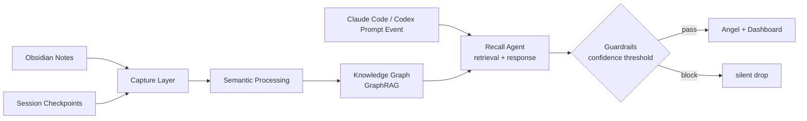

# Guardian

<p align="center">
  
</p>

<p align="center">
  <b>Capture → Connect → Recall</b>
</p>

<p align="center">
AI와 함께 만든 생각의 흔적을 자동으로 모으고, 연결하고, 다시 꺼내주는 개인 지식 그래프예요.
</p>

---

## What is Guardian?

AI와 작업하다 보면 비슷한 질문을 반복하게 돼요. 예전에 정리했던 노트나 커밋 맥락이 있어도, 코딩 중에는 다시 찾지 않게 돼요.

Guardian은 Obsidian 노트와 session checkpoint를 자동으로 수집하고, 의미 기반으로 연결해서 하나의 그래프로 정리해줘요. Claude Code와 Codex의 prompt event가 들어오면 현재 작업과 비슷한 과거 맥락을 찾아 Angel이 짧은 메시지를 띄워요.

현재는 Capture, Connect, Recall의 핵심 경로가 동작해요.

- Obsidian 노트와 session checkpoint를 자동 수집해요.
- Chroma + NetworkX로 관련 맥락을 검색하고 연결해요.
- `POST /recall`로 Recall Agent를 호출하고, `recall_logs`에 결과를 저장해요.
- `guardian-mcp` FastMCP 서버로 Claude Code와 Codex 쪽 recall tool을 노출해요.

---

## Memory Graph

<p align="center">
  
</p>

---

## Getting Started

### 1. API + Frontend

```bash
docker compose up --build
```

첫 실행 시 `BAAI/bge-m3` 모델을 다운받아요. 이후에는 `huggingface_cache` volume에서 재사용해요.

- API: http://127.0.0.1:8000
- Dashboard: http://127.0.0.1:5173

### 2. MCP Server

`.mcp.json`에 등록돼 있어요. Claude Code나 Codex에서 이 프로젝트를 열면 자동으로 실행돼요.

### 3. Ollama (선택사항)

API 장애 시 Circuit Breaker가 자동으로 Ollama로 전환해요. 평소엔 없어도 돼요.

macOS에서는 Docker 대신 로컬 설치를 권장해요. Docker는 Apple Silicon GPU(Metal)를 사용할 수 없어서 속도 차이가 커요.

```bash
brew install ollama
ollama pull qwen2.5:3b
ollama serve
```

### 4. Hooks

#### Claude Code

`.claude/settings.json`에 추가해요.

| Event | What it does |
|---|---|
| `SessionEnd` | 세션 종료 시 대화를 요약해 Guardian에 저장해요. |
| `UserPromptSubmit` | 프롬프트를 입력할 때마다 Recall Agent를 트리거해요. |

```json
{
  "hooks": {
    "SessionEnd": [
      {
        "matcher": "",
        "hooks": [
          {
            "type": "command",
            "command": "python3 ./hooks/transcript_summary.py | ./hooks/session_checkpoint_guardian.sh || true"
          }
        ]
      }
    ],
    "UserPromptSubmit": [
      {
        "matcher": "",
        "hooks": [
          {
            "type": "command",
            "command": "cat | ./hooks/guardian_hook.sh || true"
          }
        ]
      }
    ]
  }
}
```

- `|| true`: hook 실패 시 Claude Code 흐름을 막지 않아요.

#### Codex

`.codex/config.toml`에서 hooks 기능을 켜고, `.codex/hooks.json`에 훅을 넣어요.

```toml
[features]
hooks = true
```

| Event | What it does |
|---|---|
| `SessionStart` | 시작 시 workspace 컨텍스트를 불러와요. |
| `UserPromptSubmit` | 프롬프트가 들어올 때마다 recall trigger를 걸어요. |
| `PostToolUse` | 도구 사용 후 결과를 후속 처리해요. |
| `SessionEnd` | 세션 종료 시 checkpoint summary를 Guardian에 저장해요. |
| `Stop` | 세션이 끝나기 직전에 후처리를 해요. |

`.codex/hooks.json`의 실제 예시는 repo 안의 파일을 그대로 따라가면 돼요. `Entire CLI`가 없으면 훅은 조용히 건너뛰어요.

---

## Architecture



---

## Tech Stack

| Layer | Choice |
|---|---|
| Language | Python 3.11+ |
| Backend | FastAPI |
| Metadata | SQLite |
| Vector DB | Chroma |
| Graph | NetworkX |
| GraphRAG | Chroma + NetworkX (semantic + structural traversal) |
| Agent Layer | Retrieval before LLM + single LLM response call |
| LLM Resilience | Circuit Breaker (Anthropic API 장애 시 Ollama qwen2.5:3b 자동 전환) |
| Guardrails | Confidence scoring (threshold-based Angel trigger) |
| Frontend | React + Vite + d3.js |
| Claude Code / Codex integration | FastMCP + Hooks |
| Evaluation | RAGAS |

---

## How It Works

단일 에이전트 파이프라인이에요.

**Recall Agent**: 컨텍스트로 Chroma 벡터 검색과 NetworkX 그래프 순회로 연관된 청크를 선별하고, 단일 LLM call로 Angel 메시지와 관련성 점수를 생성해요. 근거가 된 노트나 checkpoint가 첨부돼요.

**Guardrails**: 관련성 점수가 threshold 아래면 Angel을 silent drop해요.

> LLM 기반 query rewrite와 multi-agent 구조는 채택하지 않았어요.
Angel은 백그라운드 트리거라 지연이 길어지면 안 되기 때문이에요.
RAGAS context precision이 0.6 아래로 떨어지거나 false positive rate가 30%를 넘으면 분리해요.

---

## Data Sources

| Source | Capture Method |
|---|---|
| Obsidian notes | `watchdog` filesystem watcher |
| Session checkpoints | session-end hook → rule-based summary |
| Claude Code / Codex prompt events | `UserPromptSubmit` hook → realtime recall trigger |

---

## Roadmap

| Status | Milestone |
|---|---|
| Done | Capture infrastructure |
| Done | Knowledge graph dashboard |
| Done | Recall Agent + Guardrails |
| Done | FastMCP recall tool |
| Next | LLM resilience layer |
| Next | RAGAS evaluation loop |

---

## Wiki

[Wiki](https://github.com/Starlight258/Guardian/wiki)

---

## Status

```text
Status: Core capture, recall, dashboard, and MCP recall tool implemented
```

---

## License

MIT
