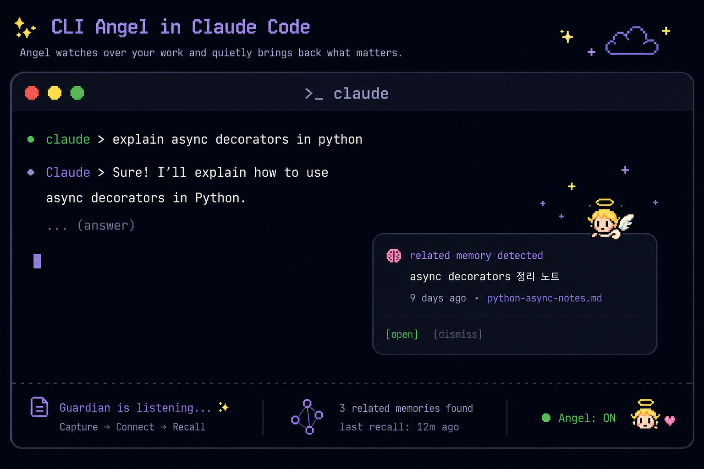
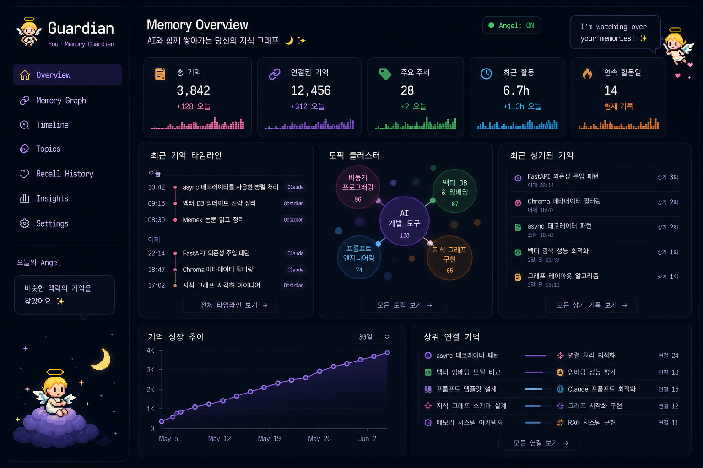
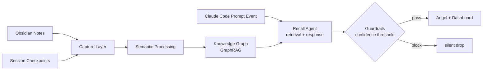

# Guardian

<p align="center">
  
</p>

<p align="center">
  <b>Capture → Connect → Recall</b>
</p>

<p align="center">
AI와 함께 만든 생각의 흔적을 자동으로 모으고, 연결하고, 다시 꺼내주는 개인 지식 그래프예요.
</p>

---

## What is Guardian?

AI와 작업하다 보면 비슷한 질문을 반복하게 돼요. 예전에 정리했던 노트나 커밋 맥락이 있어도, 코딩 중에는 다시 찾지 않게 돼요.

Guardian은 Obsidian 노트와 session checkpoint를 자동으로 수집하고, 의미 기반으로 연결해서 하나의 그래프로 정리해줘요. Claude Code prompt event가 들어오면 현재 작업과 비슷한 과거 맥락을 찾아 Angel이 짧은 메시지를 띄워요.

현재는 Capture, Connect, Recall의 핵심 경로가 동작해요.

- Obsidian 노트와 session checkpoint를 자동 수집해요.
- Chroma + NetworkX로 관련 맥락을 검색하고 연결해요.
- `POST /recall`로 Recall Agent를 호출하고, `recall_logs`에 결과를 저장해요.
- `guardian-mcp` FastMCP 서버로 Claude Code 쪽 recall tool을 노출해요.

---

## Memory Graph

<p align="center">
  
</p>

---

## Local Run

### 1. API + Frontend

```bash
docker compose up --build
```

첫 실행 시 `BAAI/bge-m3` 모델을 다운받아요. 이후에는 `huggingface_cache` volume에서 재사용해요.

- API: http://127.0.0.1:8000
- Dashboard: http://127.0.0.1:5173

### 2. MCP Server

Docker 사용 여부와 관계없이 로컬에서 따로 실행해요. Claude Code가 직접 프로세스를 띄우는 방식이라 컨테이너 안에 넣을 수 없어요.

```bash
uv run guardian-mcp
```

### 3. Claude Code Hooks

세션 체크포인트 자동 저장과 Recall 트리거를 활성화하려면 `.claude/settings.json`에 등록해요.

```json
{
  "hooks": {
    "SessionEnd": [
      {
        "matcher": "",
        "hooks": [
          {
            "type": "command",
            "command": "python3 ./hooks/transcript_summary.py | ./hooks/session_checkpoint_guardian.sh || true"
          }
        ]
      }
    ],
    "UserPromptSubmit": [
      {
        "matcher": "",
        "hooks": [
          {
            "type": "command",
            "command": "cat | ./hooks/guardian_hook.sh || true"
          }
        ]
      }
    ]
  }
}
```

- `SessionEnd`: 세션이 끝날 때 `transcript_summary.py`가 대화 내용을 요약하고, 그 결과를 `session_checkpoint_guardian.sh`가 Guardian에 저장해요.
- `UserPromptSubmit`: 프롬프트를 입력할 때마다 Recall Agent를 트리거해요.
- `|| true`: hook 실패 시 Claude Code 흐름을 막지 않아요.

---

## Architecture



---

## Tech Stack

| Layer | Choice |
|---|---|
| Language | Python 3.11+ |
| Backend | FastAPI |
| Metadata | SQLite |
| Vector DB | Chroma |
| Graph | NetworkX |
| GraphRAG | Chroma + NetworkX (semantic + structural traversal) |
| Agent Layer | Retrieval before LLM + single LLM response call |
| LLM Resilience | Circuit Breaker (Anthropic API 장애 시 Ollama qwen2.5:7b 자동 전환) |
| Guardrails | Confidence scoring (threshold-based Angel trigger) |
| Frontend | React + Vite + d3.js |
| Claude integration | FastMCP + Hooks |
| Evaluation | RAGAS |

---

## Angel Flow

Angel이 뜨기까지의 단일 에이전트 파이프라인이에요.

**Recall Agent** : 현재 작업 컨텍스트를 받아 Chroma 벡터 검색과 NetworkX 그래프 순회로 관련 청크를 선별한 뒤, 단일 LLM call로 Angel 메시지와 관련성 점수를 생성해요. 메시지에는 근거가 되는 노트나 checkpoint가 함께 첨부돼요.

**Guardrails** : Recall Agent 출력의 관련성 점수가 threshold 아래면 Angel을 silent drop해요. False positive를 막아서 Angel이 의미 있을 때만 떠요.

> LLM 기반 query rewrite와 multi-agent 구조는 의도적으로 채택하지 않았어요. 
Angel은 백그라운드 트리거라 지연이 길어지면 안되기 때문이에요. 
RAGAS context precision이 0.6 아래로 떨어지거나 false positive rate가 30%를 넘으면 그때 분리해요.

---

## Data Sources

| Source | Capture Method |
|---|---|
| Obsidian notes | `watchdog` filesystem watcher |
| Session checkpoints | session-end hook → rule-based summary |
| Claude Code prompt events | `UserPromptSubmit` hook → realtime recall trigger |

---

## Roadmap

| Status | Milestone |
|---|---|
| Done | Capture infrastructure |
| Done | Knowledge graph dashboard |
| Done | Recall Agent + Guardrails |
| Done | FastMCP recall tool |
| Next | LLM resilience layer |
| Next | RAGAS evaluation loop |

---

## Wiki

[Wiki](https://github.com/Starlight258/Guardian/wiki)

---

## Status

```text
Status: Core capture, recall, dashboard, and MCP recall tool implemented
```

---

## License

MIT
