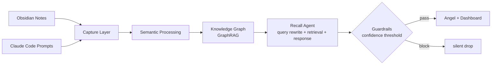

# Guardian

<p align="center">
  
</p>

<p align="center">
  <b>Capture → Connect → Recall</b>
</p>

<p align="center">
AI와 함께 만든 생각의 흔적을 자동으로 모으고, 연결하고, 다시 꺼내주는 개인 지식 그래프예요.
</p>

---

## What is Guardian?

AI와 작업하다 보면 비슷한 질문을 반복하게 돼요. 예전에 정리했던 노트나 프롬프트가 있어도, 코딩 중에는 다시 찾지 않게 돼요.

Guardian은 Obsidian 노트와 Claude Code 프롬프트를 자동으로 수집하고, 의미 기반으로 연결해서 하나의 그래프로 정리해줘요. 현재 작업과 비슷한 과거 맥락이 감지되면 Angel이 짧은 메시지를 띄워요.

MVP는 개인 AI 학습 흐름의 기억 보조 레이어에 집중해요.

---

## Memory Graph

<p align="center">
  
</p>

---

## Architecture



---

## Tech Stack

| Layer | Choice |
|---|---|
| Language | Python 3.11+ |
| Backend | FastAPI |
| Metadata | SQLite |
| Vector DB | Chroma |
| Graph | NetworkX |
| GraphRAG | Chroma + NetworkX (semantic + structural traversal) |
| Agent Layer | Single LLM call (query rewrite + retrieval + response in one prompt) |
| Guardrails | Confidence scoring — threshold-based Angel trigger |
| Frontend | React + Vite + d3.js |
| Claude integration | MCP Server + Hooks |
| Evaluation | RAGAS |

---

## Angel Flow

Angel이 뜨기까지의 단일 에이전트 파이프라인이에요.

**Recall Agent** — 현재 작업 컨텍스트를 받아서 하나의 LLM call 안에서 검색 쿼리를 재작성하고, Chroma 벡터 검색과 NetworkX 그래프 순회를 조합해 관련 청크를 선별하고, Angel 메시지를 생성해요. 메시지에는 근거가 되는 노트가 함께 첨부돼요.

**Guardrails** — Recall Agent 출력의 관련성 점수가 threshold 아래면 Angel을 silent drop해요. False positive를 막아서 Angel이 의미 있을 때만 떠요.

> Multi-agent (Retrieval / Response 분리) 는 의도적으로 채택하지 않았어요. Angel은 백그라운드 트리거라 지연이 곧 UX 손상이고, 현 단계에서는 single call로 품질이 충분해요. RAGAS context precision이 0.6 아래로 떨어지거나 false positive rate가 30%를 넘으면 그때 분리해요.

---

## Data Sources

| Source | Capture Method |
|---|---|
| Obsidian notes | `watchdog` filesystem watcher |
| Claude Code prompts | `UserPromptSubmit` hook |

---

## Roadmap

| Week | Milestone |
|---|---|
| 1-2 | Capture infrastructure |
| 3-4 | Knowledge graph dashboard |
| 5 | Recall Agent + Guardrails |
| 6 | MCP integration |

---

## Status

```text
Status: Designing
Implementation starts: June 2026
```

---

## License

MIT
