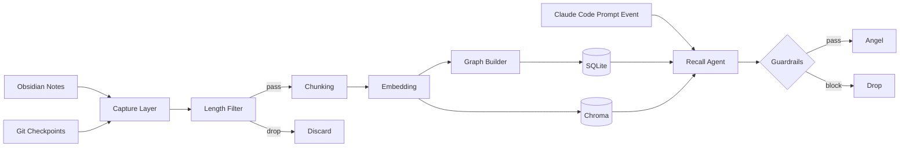

# Architecture

Guardian은 AI 작업 과정에서 생성되는 노트와 commit-session checkpoint를 수집하고,  
Claude Code prompt event로 현재 작업에 맞는 과거 맥락을 다시 꺼내주는 개인 기억 저장소예요.

> `Capture → Connect → Recall`

전체 흐름은 아래와 같아요.


<details>
<summary> [Capture → Connect → Recall] Mermaid </summary>



</details>


| 단계 | 역할 |
|---|---|
| Capture | 노트와 commit-session checkpoint를 수집해요 |
| Connect | Chunking · Embedding · Graph를 구축해요 |
| Recall | prompt event를 trigger로 검색 · 응답 · Guardrails를 처리해요 |

---

# Capture

Guardian은 로컬 작업 흐름을 지속적으로 수집해요.  
수동 sync 단계는 없어요.

## Obsidian

Markdown 파일 변경을 filesystem watcher로 감지해요.

추적 이벤트

- create
- update
- delete

## Claude Code Prompt Event

Claude Code `UserPromptSubmit` hook은 장기 memory source가 아니라 realtime Recall trigger로 사용해요.

- user prompt
- timestamp
- session metadata

Prompt event는 `/events/prompt`로 전달되고, length filter를 통과하면 현재 작업 컨텍스트로 Recall을 호출해요.  
원문 prompt는 장기 chunk로 저장하지 않아요.

| 선택 | 이유 |
|---|---|
| prompt event를 trigger로 사용 | commit checkpoint와 장기 memory 중복을 피해요 |
| 원문 prompt 장기 저장 안 함 | retrieval noise와 민감정보 저장 위험을 줄여요 |
| session 전체 미수집 | 운영 복잡도를 줄여요 |

## Git Checkpoint

Commit 이후 checkpoint는 장기 memory source로 저장해요.
post-commit hook은 `Entire-Checkpoint:` trailer가 있으면 `entire checkpoint explain --commit HEAD --short --no-pager` 결과를 우선 Guardian에 전달하고, Entire summary가 없으면 commit message와 changed files로 만든 rule-based summary를 저장해요. commit message 줄에 `?`, `왜`, `고민`, `생각`이 포함되면 그 줄을 질문 목록으로 정리해요.

- commit SHA
- commit message
- branch
- changed files
- Entire session summary 또는 rule-based fallback summary

`commit_sha` 기준으로 중복 수집을 막고, Obsidian 노트와 같은 chunking · embedding · graph 경로를 통과시켜요.

---

# Connect

수집된 텍스트는 검색 전에 가공해요.

## Length Filter

짧은 prompt event나 문서는 처리하지 않아요.

예:

- ok
- thanks
- ㄱㅅ

낮은 signal 데이터를 early discard해서 저장 비용과 retrieval noise를 줄여요.

---

## Chunking

문서는 chunk 단위로 분할해요.

목표 
- 검색 정확도 (retrieval precision) 개선
- 임베딩에 들어가는 잡음 (embedding noise) 감소
- 의미 그래프의 엣지 품질 (semantic edge quality) 개선

| 입력 유형 | 전략 |
|---|---|
| 구조화된 노트 | Header 기반 split |
| 비구조화 노트 | Sliding window |
| 짧은 prompt event | filter 단계에서 제외 |

| 항목 | 값 |
|---|---|
| Chunk size | 512 tokens |
| Overlap | 20% |

Overlap은 chunk 경계에서 의미가 끊기는 문제를 줄이기 위한 설정이에요.

---

## Embedding & Graph

Chunk는 embedding vector로 변환해요.

1. Chroma에 저장해서 semantic retrieval에 사용해요
2. 신규 chunk마다 Chroma top-k 후보만 비교해 유사 chunk 간 edge를 생성해요

---

# Storage

데이터는 역할별로 분리 저장해요.

| 저장소 | 역할 |
|---|---|
| SQLite | metadata |
| Chroma | vector storage |

`chunk.id`는 두 저장소에서 동일하게 사용해요.
> 별도 mapping layer 없이 retrieval 경로를 단순화하기 위한 결정이에요.

| 선택 | 장점 | 비용 |
|---|---|---|
| Shared chunk ID | retrieval 경로가 단순해져요 | storage coupling이 증가해요 |
| Storage 분리 | 역할 분리가 명확해져요 | consistency 관리가 필요해요 |
| Mapping layer 제거 | 운영이 단순해져요 | abstraction이 약해져요 |

---

# Recall

Recall은 단일 LLM call로 처리해요.

LLM 호출 전에 retrieval context를 먼저 구성해요.

1. 현재 작업 컨텍스트로 Chroma top-k retrieval
2. NetworkX 인접 노드 주입
3. 단일 LLM call로 relevance score와 Angel message 생성


## Single Call을 선택한 이유

Angel은 작업 흐름 중간에 백그라운드로 실행돼요.

그래서 latency가 주요 설계 기준이에요.

| 항목 | Single | Multi-agent |
|---|---|---|
| LLM calls | 1 | 2+ |
| Latency | 낮아요 | 높아요 |
| Debugging surface | 작아요 | 커져요 |
| Token cost | 낮아요 | 높아요 |

Multi-agent의 분리 이점보다 응답 속도를 우선했어요.

LLM 기반 query rewrite는 MVP에서 제외해요. 검색 입력은 현재 작업 컨텍스트를 그대로 사용하고, BGE-M3 dense retrieval이 semantic search를 담당해요.

---

# Guardrails

Recall Agent는 relevance score를 함께 반환해요.

threshold 미만이면 Angel을 띄우지 않고 drop해요.

```text
Recall Agent
    ↓
[message + relevance score]
    ↓
score ≥ threshold ?
    ├─ Yes → Angel
    └─ No  → Drop
```

Guardrails는 별도 agent가 아닌 단순 후처리 함수로 구현해요.

| 선택 | 장점 | 비용 |
|---|---|---|
| Single LLM call | 저지연 · 저비용 | prompt 복잡도가 증가해요 |
| Query rewrite 제외 | retrieval 흐름이 단순해요 | 검색 품질 튜닝 여지가 줄어요 |
| Post-hoc guardrails | 구조가 단순해져요 | calibration이 필요해요 |

---

# Intentional Non-Adoption

| 기술 | 제외 이유 | 도입 조건 |
|---|---|---|
| Multi-agent | Single call로 충분해요 | latency보다 품질이 중요해질 때 |
| Airflow | cron 수준으로 충분해요 | ingestion source가 증가할 때 |
| Elasticsearch | semantic retrieval 중심이에요 | full-text 요구가 커질 때 |
| Kubernetes | 단일 컨테이너 운영이에요 | multi-host 배포가 필요할 때 |
| Neo4j | NetworkX로 충분해요 | graph 규모가 커질 때 |

---

# Evolution Triggers

아래 조건 중 하나라도 발생하면 Recall 구조를 분리해요.

| Signal | Threshold | 대응 |
|---|---|---|
| RAGAS precision | < 0.6 | Retrieval을 분리해요 |
| False positive rate | > 30% | Response layer를 분리해요 |
| Prompt length | > 800 tokens | 단계를 분리해요 |
| 모델 차등화 필요 | — | retrieval / response를 분리해요 |

측정값이 나오기 전까지는 agent를 분리하지 않아요.
